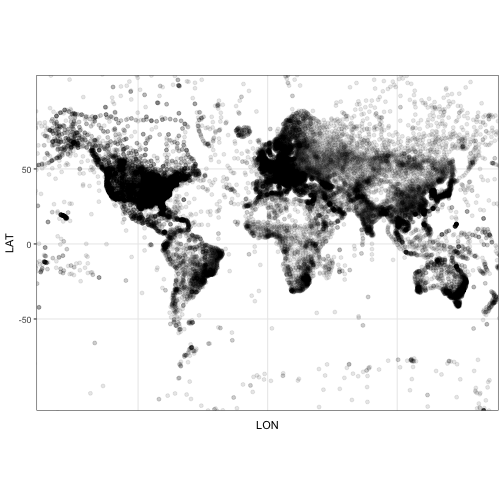

I Did Something About the Weather
========================================================
author: Adam H Sparks
date: 2017-05024
autosize: true

About Me
========================================================

**Currently:** A/Prof Field Crops Pathology @ USQ CCH, Toowoomba, AUS

**Previously:** Plant Disease Management Specialist @ IRRI, Los Baños, PHL

### R packages (on CRAN)

GSODR (Sparks, Hengl and Nelson)

getCRUCLdata (Sparks)

### R packages (not yet on CRAN)

bomrang (Sparks, Parsonage and Pembleton)

GSOD Data
========================================================

The GSOD or [Global Surface Summary of the Day (GSOD)](https://data.noaa.gov/dataset/global-surface-summary-of-the-day-gsod) station locations. US National Centers for Environmental Information, 1901-Present.

GSOD Data File
========================================================

A raw data file

